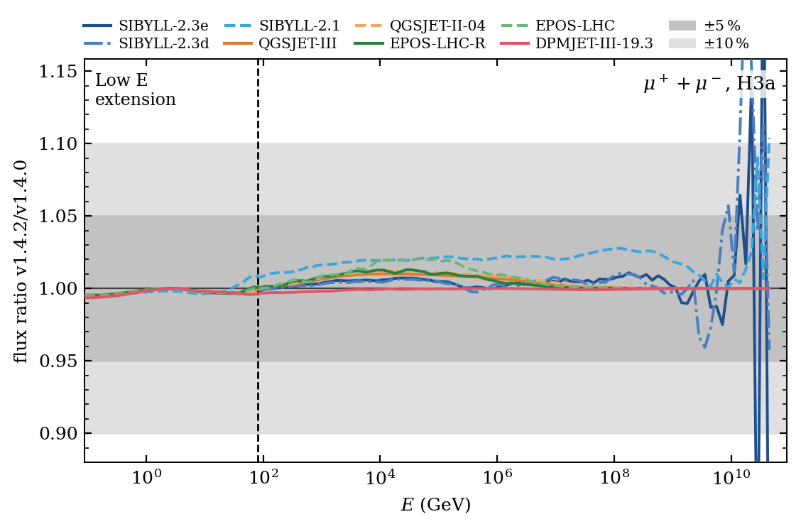
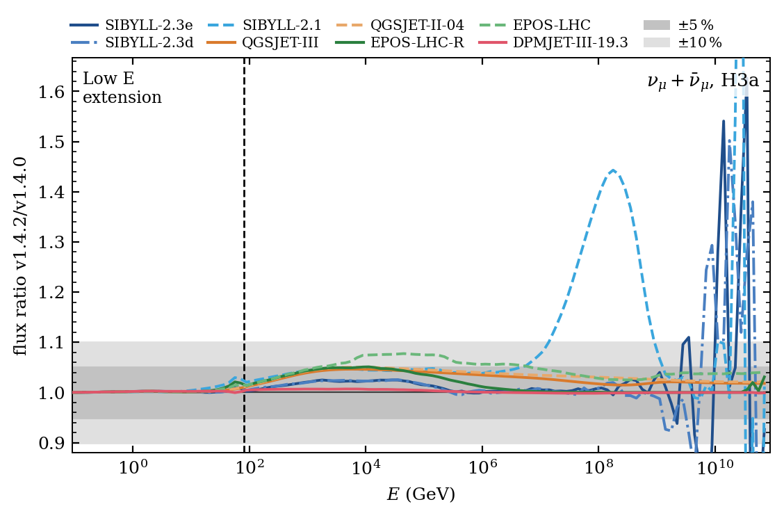
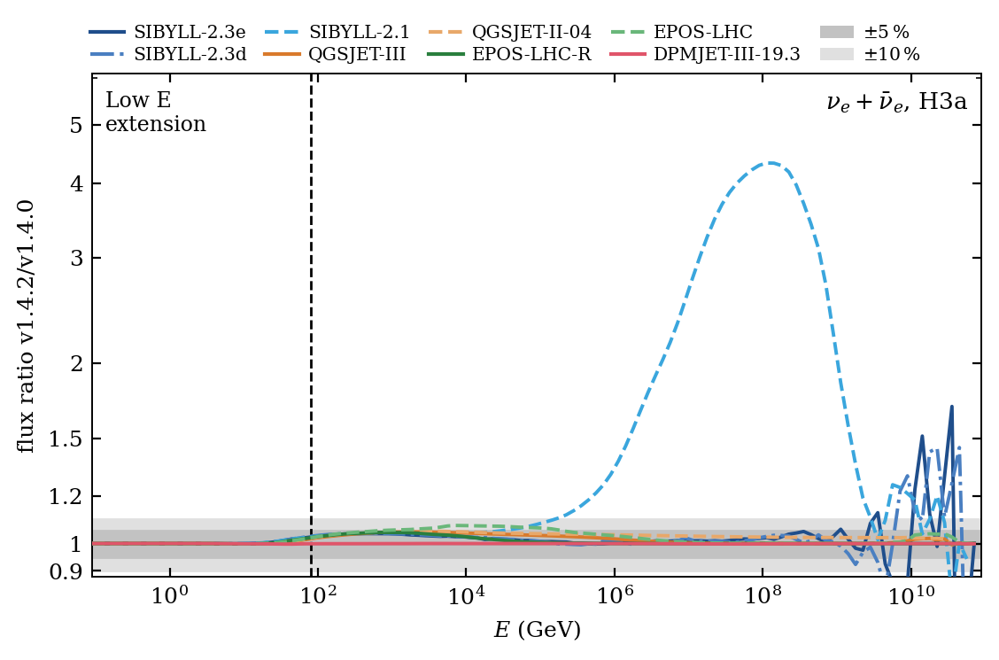
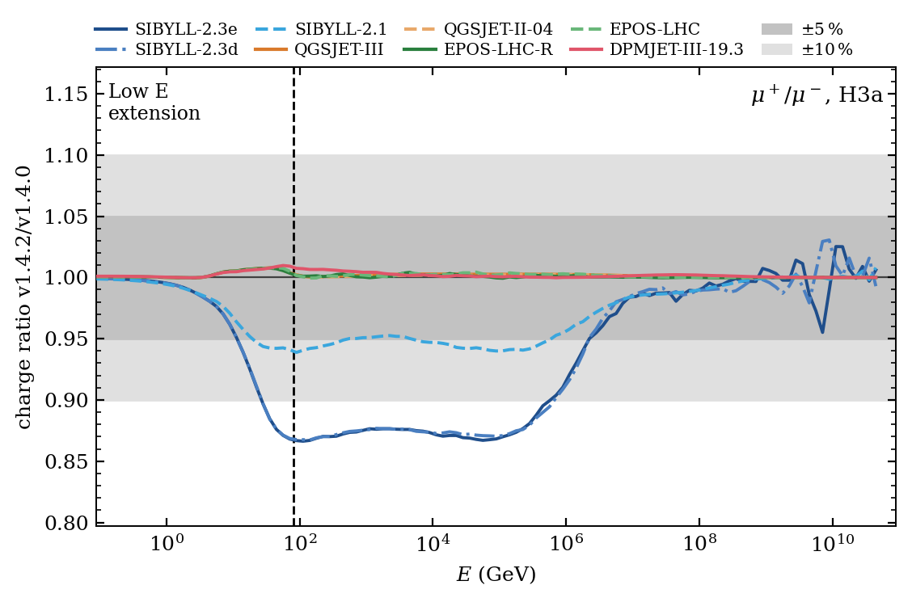
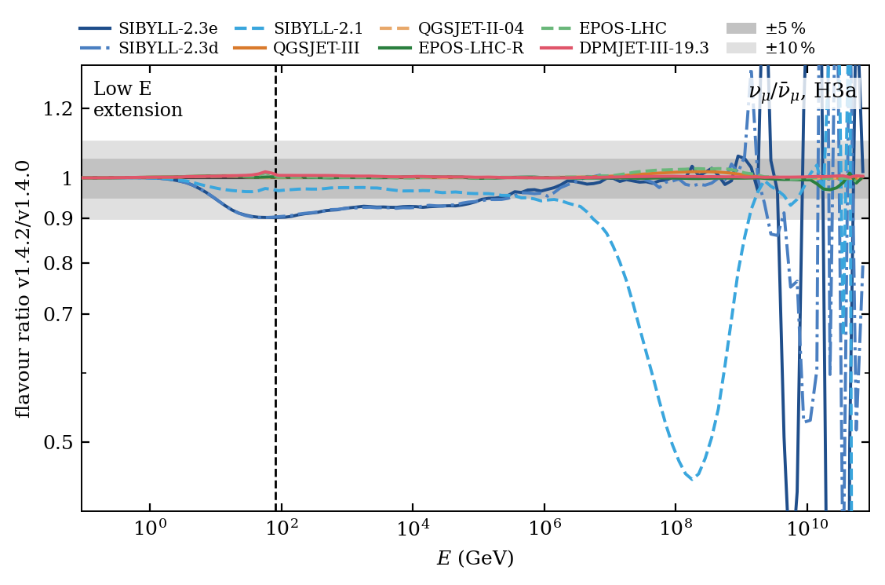
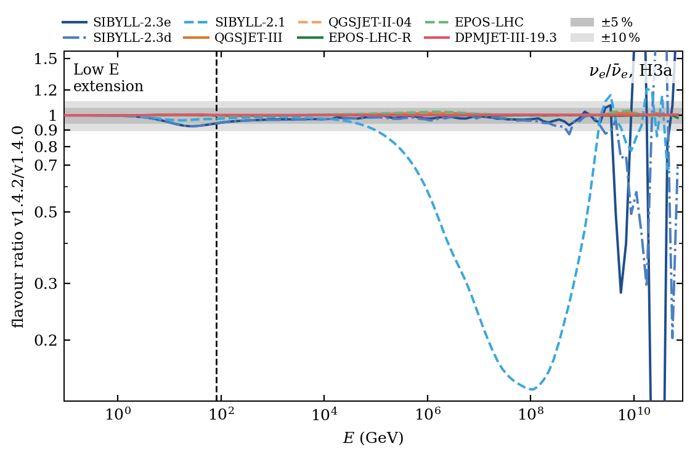
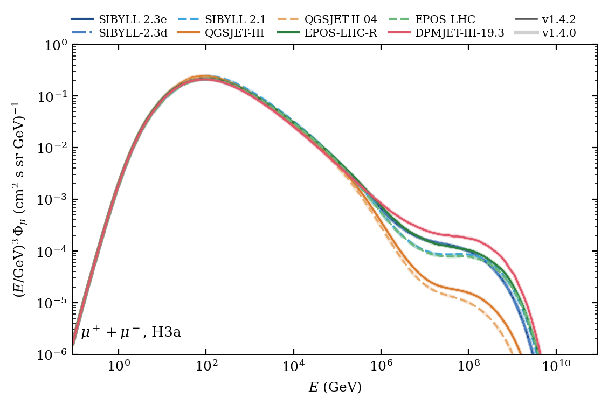
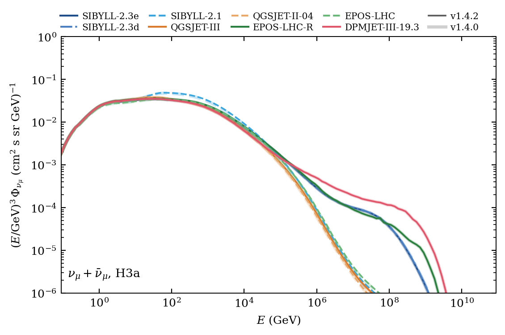
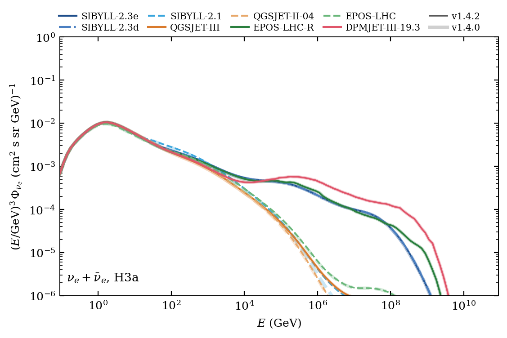

.. _v142v141_diff:

MCEq v1.4.2
###########

.. attention::
  MCEq v1.4.2 is a **database bugfix release**.

| The **Sibyll** hadronic interaction matrices have been **regenerated** with a fixed version of chromo_.
| In v1.4.0 and v1.4.1 neutron projectiles were simulated as protons in the Sibyll models.
| Nothing has to be changed in your code: the corrected database is downloaded automatically the first
  time you import MCEq after the update.

What does this mean for my results?
===================================

* **Recomputation is recommended** if your results were obtained with Sibyll-2.1, Sibyll-2.3d or
  Sibyll-2.3e from the v1.4.0/v1.4.1 database. Charge and flavor ratios are affected the most, since
  the bug acts on the charge asymmetry of the mesons and not on their total number.

What has changed?
=================

1. Sibyll interaction matrices

   | The hadronic interaction yields of **Sibyll-2.1**, **Sibyll-2.3d** and **Sibyll-2.3e** and its star models 
   | have been regenerated with a fixed version of chromo_ (see `chromo PR #275 <https://github.com/impy-project/chromo/pull/275>`_).
   | Neutron projectiles are now treated as neutrons and no longer as protons.

2. Cross sections

   | DPMJetIII-19.3 now correctly uses the anti-particle cross-sections instead of only the non-conjugate particle cross-sections.

.. _Changelog: https://github.com/mceq-project/MCEq/blob/main/CHANGELOG.md
.. _chromo: https://github.com/impy-project/chromo

Database Comparison
-------------------

The following figures compare the v1.4.2 database against the database of v1.4.1/v1.4.0. Every model is
compared against *itself*, computed with the H3a primary model of crflux_ for a vertical zenith angle
and ``config.enable_em = False``, everything else at the MCEq defaults.

.. hint::
  The excursions you see in some plots fix the buggy excursions that were seen in the
  :ref:`v1.4.0 release <v14v13_diff>`.

.. _crflux: https://github.com/afedynitch/crflux

Lepton Fluxes
^^^^^^^^^^^^^

Lepton Charge and Flavor
^^^^^^^^^^^^^^^^^^^^^^^^

Here the effect of the fix is most visible.

Absolute Fluxes
^^^^^^^^^^^^^^^

The absolute lepton fluxes of all models, v1.4.2 (thin lines) over v1.4.0 (thick, faded lines).

Contact
=======

We track various changes in much more detail.
If you encounter any problems, please contact Stefan_.

.. _Stefan: mailto:stefanfroese@as.edu.tw
