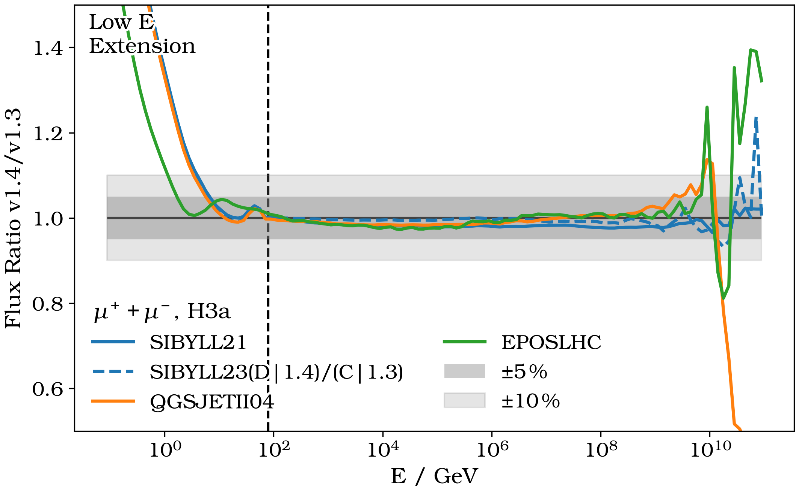
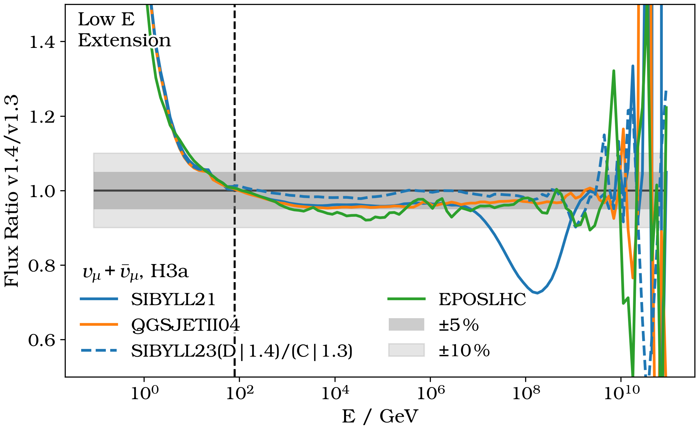
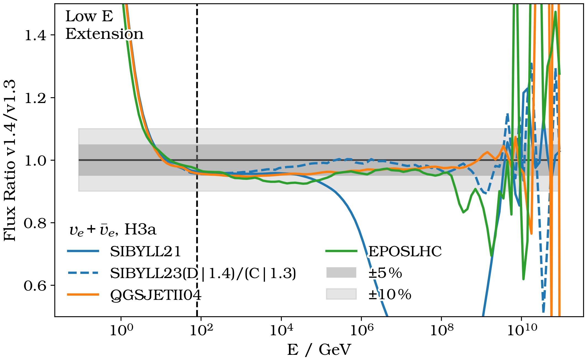
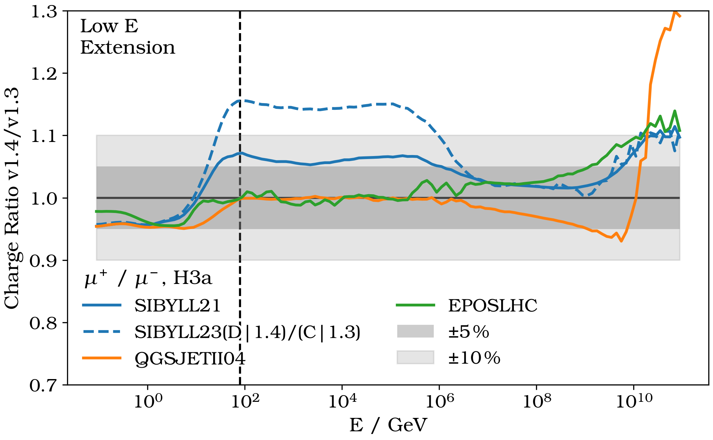
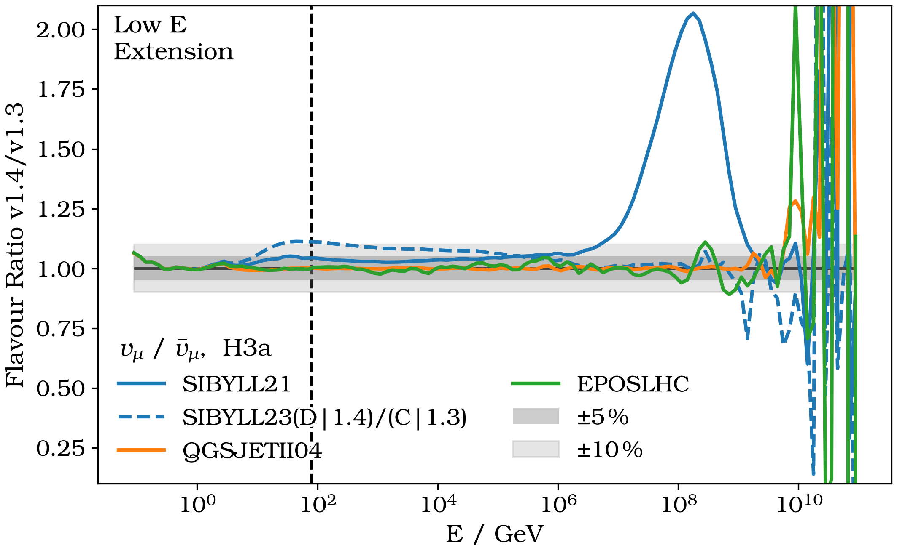
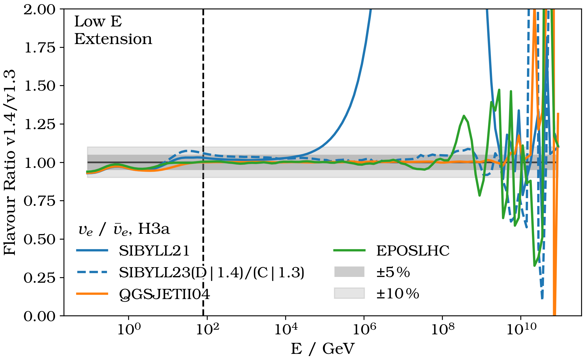
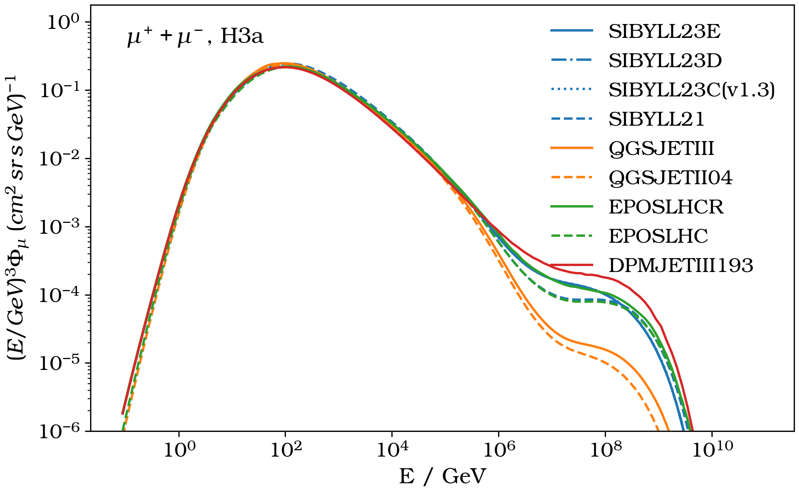
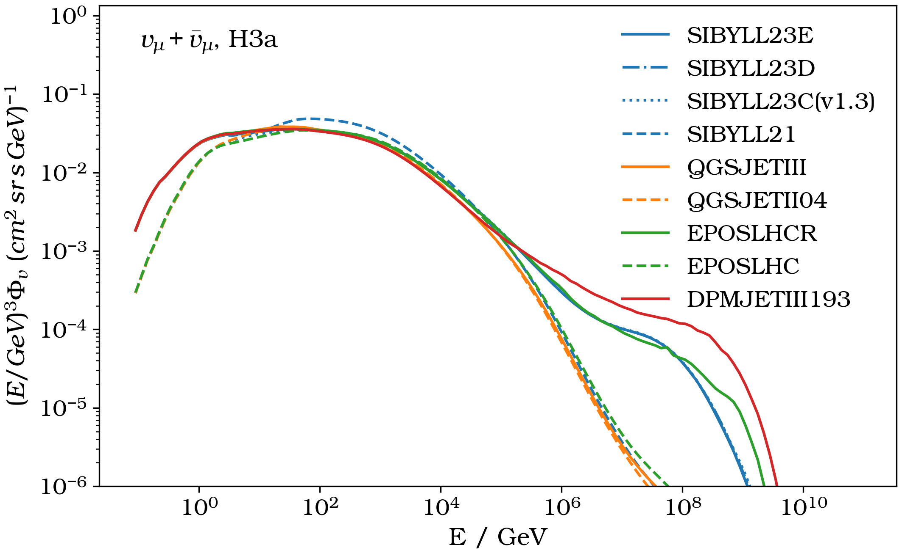
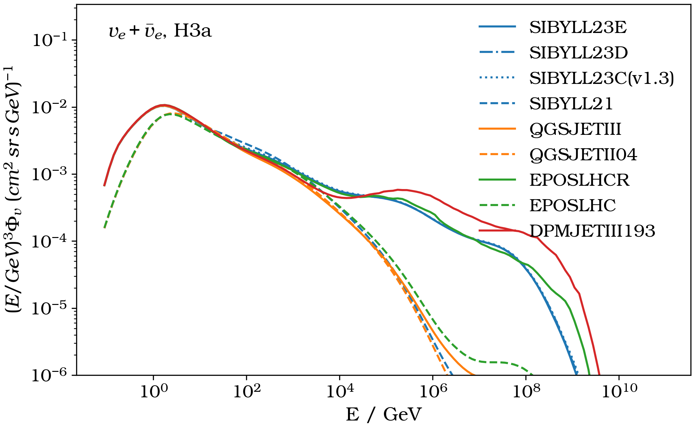

.. _v14v13_diff:

MCEq v1.4
#########

Welcome to MCEq v1.4, a long foreseen release!

| With this versions we updated major parts of the MCEq database.
| We introduce **new Hadronic Interaction Models**, **updated decay yields**, and **updated cross sections**.
| The **Data Driven Model (DDM)** is additionally available with this release.

What has changed?
=================

For a more detailed list please refer to the latest Changelog_.

The significant changes are updates to the MCEq database!

1. Hadronic Interaction Models

   | The new database is composed of a set of **baseline models** (Sibyll-2.1, QGSjetII04, Epos-LHC),
   | to provide a comparison between MCEq v1.3 and v1.4, as well as a set of **new models** (Sibyll-2.3d, Sibyll-2.3e, QGSjetIII, DPMJetIII-19.3, Epos-LHC-R).
   | All hadronic interaction yields in the database have been updated.

2. Decay Yields

   | The calculation of decay yields moved completly to the *Pythia* interface of chromo_.

3. Cross Sections

   | All cross sections are updated to **production** cross sections of the particle of interest.

.. _Changelog: https://github.com/mceq-project/MCEq/blob/main/CHANGELOG.md
.. _chromo: https://github.com/impy-project/chromo

Baseline Comparison
-------------------

In the following we compare the aforementioned baseline models (Sibyll-2.1, QGSjetII04, Epos-LHC) in v1.4 against v1.3.
In addition, we compare Sibyll-2.3c from v1.3 with Sibyll-2.3d from v1.4 for completness since it is no longer part of the database.

These resulting ratios are impacted by the above listed changes.

**SIBYLL21**: The drastic change you can see here results from previous mixup of particle IDs.

**Low E Extension**: Within this region (below 80 GeV) all models are extended with DPMJetIII.
The new database uses DPMJetIII-19.3 instead of DPMJetIII-19.1.

**Ultra High Energies**: Towards 1e9 GeV and above the ratio is dominated by statistical flucations from the Monte Carlo generation of the 
hadronic interaction matrices at high projectile energy.

Lepton Fluxes
^^^^^^^^^^^^^

Lepton Charge and Flavor
^^^^^^^^^^^^^^^^^^^^^^^^

New Model Fluxes
----------------

In this section you can find the lepton fluxes of all new and old models.

Contact
=======

We track various changes in much more detail. 
If you encounter any problems, please contact Stefan_.

.. _Stefan: mailto:stefanfroese@as.edu.tw
