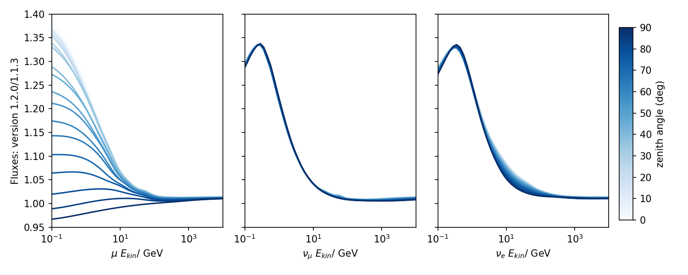
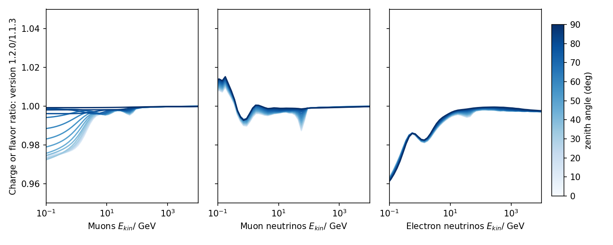

.. _v14v13_diff:

MCEq v1.4
#########

Welcome to MCEq v1.4, a long foreseen release!
With this versions we updated major parts of the MCEq database.
We introduce **new Hadronic Interaction Models**, **updated decay yields**, and **updated cross sections**.
The **Data Driven Model (DDM)** is additionally available with this release.

What has changed?
=================

For a more detailed list please refer to the latest Changelog_.

The signficant changes are updates to the MCEq database!

1. Hadronic Interaction Models
   The new database is composed of a set of **baseline models** (Sibyll-2.1, QGSjetII04, Epos-LHC),
   to provide a comparison between MCEq v1.3 and v1.4, as well as a set of **new models** (Sibyll-2.3d, Sibyll-2.3e, QGSjetIII, DPMJetIII-19.3, Epos-LHC-R).
2. Decay Yields
   The calculation of decay yields moved to completly to the *Pythia* interface of chromo_.
   Decays are now computed in the rest-frame of the particle of interest.
3. Cross Sections
   All cross sections are updated to present the **production** cross section of the particle of interest.

.. _Changelog: https://github.com/mceq-project/MCEq/blob/main/CHANGELOG.md
.. _chromo: https://github.com/impy-project/chromo

Lepton Fluxes
-------------

    Ratio of fluxes generated with the H3a primary model and EPOS-LHC
    between the versions 1.2.0 and 1.1.3 (from left to right for muons, muon
    neutrinos and electron neutrinos). Shades are used for different zenith angles.

    Ratio of muon charge ratio (left) and neutrino/anti-neutrino ratios (center and right)
    generated with the H3a primary model and EPOS-LHC between the versions 1.2.0 and 1.1.3.
    Shades are used for different zenith angles. Note that the scale is different compared to
    the upper plot.

The origin of this changes is a bug in the scripts used for the generation of the decay
tables. The bug was a "wrong" formula for the boost discovered by Matthias Huber, thx.
The effect is strongest at low energies as seen in the plots. At high energies there are
no changes.  For fluxes the changes are most striking in the zenith distribution of muons.
For neutrinos the effect is mostly related to the spectral index. For electron neutrinos
there is some effect for the zenith distribution at tens of GeV and will affect predictions
made for IceCube DeepCore or KM3Net-ORCA. Update and recomputation of expectations is therefore
recommended. For high energies, i.e. IceCube/P-ONE/ARCA recomputation is not necessary.

Contact
=======

We track various changes in much more detail. 
If you encounter any problems, please contact :email:`Stefan <stefanfroese@as.edu.tw>`.
